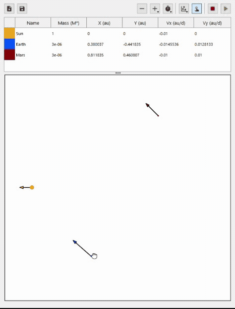
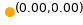
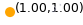
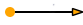

# N-Body Simulator


This project creates a QWidget used for simulating a gravitational system of N bodies in two dimensions.

<p align="center">
  
</p>

## Table of contents
* [Installation](#installation)
* [Usage](#usage)
* [About](#about)
* [Features](#features)

## Installation

This widget was created using **Python v3.8**, and using **CMake v3.12**. These versions are a minimum requirement. It is also recommended that you create a [virtual environment](https://packaging.python.org/guides/installing-using-pip-and-virtual-environments/) and activate it before starting the installation process.

The first step is to clone the code in this repository using [git](https://git-scm.com/downloads):

```sh
git clone git@github.com:robertapplin/N-Body-Simulations.git
```

Then install the python environment requirements and Qt dependencies using pip:

```sh
pip install -r requirements.txt
```

Next, from within the project source directory, build and install the project. If this command fails, try running it as admin.

```sh
python setup.py install
```

The n-body-simulations package can now be found in the site-packages of your virtual environment.

## Building Locally

You can also build the code locally from git bash, from your source directory and with your virtual environment activated:

```sh
cmake --preset=win .
cmake --build ../build
```

Remember to update the `VIRTUAL_ENV_PATH` found in the `CMakePresets.json` file before doing this.

## Usage

From python, you can now import and open the widget as follows:

```py
from n_body_simulations.startup import startup_widget

startup_widget()
```

It is also possible to embed the widget into an existing interface.

## About

The purpose of this project was to develop my programming skills by creating a maintainable and well-tested cross-platform application. In this project I have created a simulator for N-Body gravitational systems which allows the collision and merging of bodies. The **docs** folder contains example \**.txt* files which can be loaded into this widget.

The following units have been used for this project:

  |Quantity  |Measured in               |Unit|
  |----------|--------------------------|----|
  |Mass      |Solar masses              |M*  |
  |Position  |Astronomical units        |au  |
  |Time      |Days                      |d   |
  |Velocity  |Astronomical units per day|au/d|

## Features

The widget has several options which are found above the data table:

  |Button                                                                            |Description                                                                    |
  |----------------------------------------------------------------------------------|-------------------------------------------------------------------------------|
  |            |Load a \**.txt* file containing initial parameters for an N-Body-Simulation.   |
  |            |Save the initial parameters of an N-Body-Simulation to a \**.txt* file.        |
  |          |Remove the selected bodies from the simulation.                                |
  |             |Add bodies to the simulation.                                                  |
  |    |Adjust the time step and duration of the simulation.                           |
  ||Show or hide position labels and velocity arrows on the plot.                  |
  ||Turn on interactive mode, allowing you to interact with the bodies on the plot.|
  |            |Stop the simulation.                                                           |
  |      |Play or Pause the simulation.                                                  |

The widget also includes an interactive plot where you can:

  |Image                                                                 |Description                                                                          |
  |----------------------------------------------------------------------|-------------------------------------------------------------------------------------|
  |         |Adjust the colour and name used to represent a body.                                 |
  ||Adjust the position of a body by dragging the body on the interactive plot.          |
  ||Adjust the velocity of a body by dragging the velocity arrow on the interactive plot.|
